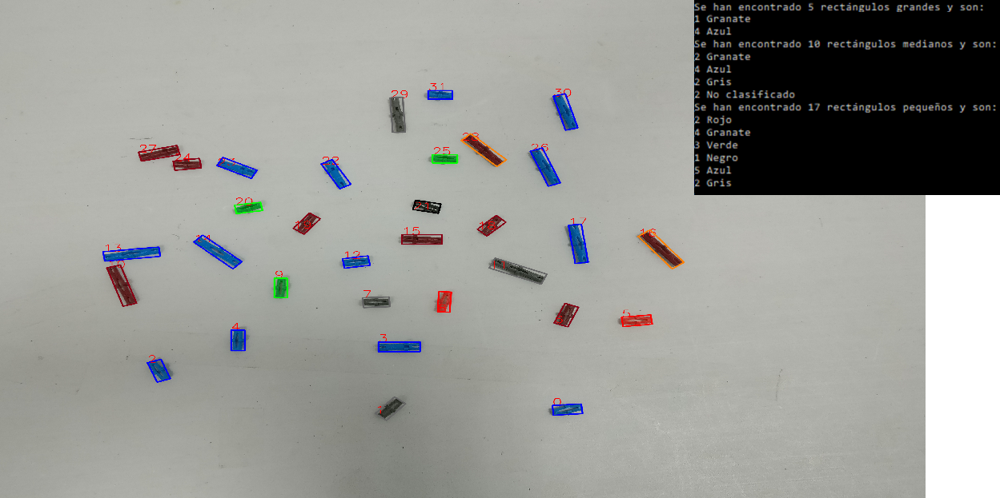

# opencv-pin-classifier
Computer vision application that classifies and counts small colored plastic pins from static images

## Authors 

* **Irene Álvarez Caro**
* **David Borreguero Díaz**
* **Ruben Sanchez** - [rubinsan](https://github.com/rubinsan)

## License

This project is licensed under the [MIT License](LICENSE).
